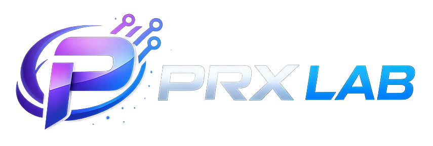

# PRX Lab

Bem-vindo à página oficial da **PRX Lab**, um laboratório de desenvolvimento focado na criação de **software moderno, soluções digitais e projetos baseados em inteligência artificial**.

Nossa missão é desenvolver tecnologias eficientes, escaláveis e bem arquitetadas, explorando novas ideias e transformando conceitos em soluções reais para a web, automação e análise de dados.

---

## Sobre a PRX Lab

A **PRX Lab** é um laboratório independente de desenvolvimento criado por **Guilherme Basso** e **Gustavo Pulz**, com foco na construção de sistemas, plataformas e experimentos tecnológicos.

Nosso trabalho envolve o desenvolvimento de aplicações modernas, desde **interfaces front-end até arquiteturas backend complexas**, sempre priorizando boas práticas de engenharia de software, performance e escalabilidade.

Dentro da PRX Lab exploramos novas tecnologias, desenvolvemos protótipos, criamos ferramentas e construímos projetos que unem **engenharia de software, dados e inteligência artificial**.

---

## Áreas de atuação

Na PRX Lab trabalhamos principalmente com:

- 🌐 **Desenvolvimento Web**
  - Sites institucionais
  - Aplicações web modernas
  - Interfaces responsivas

- ⚙️ **Backend & APIs**
  - APIs escaláveis
  - Arquiteturas modernas
  - Integração de sistemas

- 🧠 **Inteligência Artificial**
  - Sistemas baseados em IA
  - Processamento de dados
  - Automação inteligente

- 📊 **Dados e Analytics**
  - Processamento de dados
  - Dashboards
  - Sistemas analíticos

- 🧪 **Projetos experimentais**
  - Prototipagem
  - Provas de conceito
  - Testes de novas tecnologias

---

## Filosofia

Acreditamos que tecnologia deve ser construída com base em três pilares:

- **Qualidade de engenharia**
- **Escalabilidade**
- **Inovação constante**

Por isso, a PRX Lab funciona como um espaço para experimentar novas ideias, desenvolver soluções robustas e compartilhar conhecimento através de código.

---

## Fundadores

- **Guilherme Basso**  
  GitHub: https://github.com/GRoxo-B

- **Gustavo Pulz**  
  GitHub: https://github.com/gustavopulz

---

## Repositórios

Os repositórios desta organização incluem projetos relacionados a:

- desenvolvimento de software
- ferramentas internas
- sistemas web
- experimentos com IA
- bibliotecas e utilidades

---

## Contato

Caso tenha interesse em nossos projetos ou queira colaborar, sinta-se à vontade para explorar nossos repositórios ou entrar em contato através dos perfis GitHub dos fundadores.

---

⭐ Se algum projeto for útil para você, considere deixar uma estrela nos repositórios!
